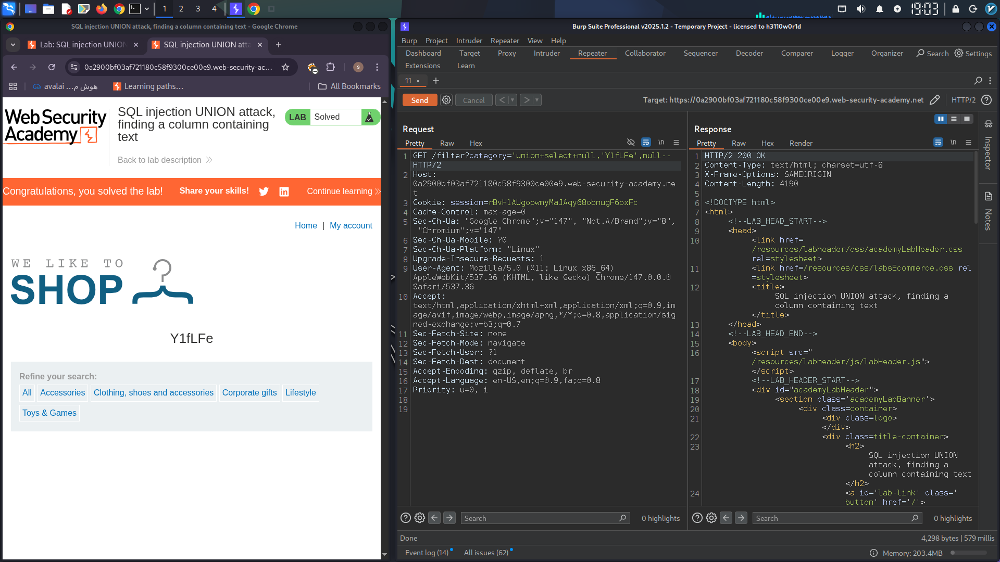

```markdown
# **Exploiting SQL Injection: A UNION Attack on a Web Security Lab**

This report documents the successful exploitation of a **SQL injection vulnerability** within a controlled web security lab environment. The vulnerability was located in the product category filter, and the attack method employed was a **UNION-based SQL injection**.

## **Lab Environment and Objective**

The target lab environment is accessible via the following URL:
`https://0a2900bf03af721180c58f9300ce00e9.web-security-academy.net/filter?category='union+select+null,'Y1fLFe',null--`

The primary objective of this exercise was to:
1.  **Determine the exact number of columns** returned by the original SQL query.
2.  **Identify which of these columns are compatible with string data types** to successfully inject and display custom text.

---

## **Exploitation Process**

The vulnerability lies in the `category` parameter of the product filter. By intercepting and modifying HTTP requests, particularly using tools like **Burp Suite**, it's possible to manipulate the SQL query executed by the backend.

### **Initial Payload: The `NULL` Challenge**

A standard technique to ascertain the number of columns in a SQL query is to use a `UNION SELECT` statement with `NULL` placeholders. I started by attempting to confirm the query returned three columns:

```sql
' UNION SELECT NULL, NULL, NULL--
```

**Observation:** This initial payload did not elicit the expected response. The server did not reflect the injected data or return a structural error that would confirm the column count. This indicated that a simple `NULL`-filled payload was insufficient, possibly due to the backend's handling of `NULL` values or a strict data type requirement in certain columns.

### **Advanced Payload: Iterative String Replacement**

Given the failure of the `NULL`-only approach, the next step was to identify which column could accept string input. The lab provided a specific random value, `'Y1fLFe'`, which needed to be displayed. The strategy involved replacing each `NULL` placeholder one by one with this target string:

1.  **Testing the first column:**
    ```sql
    ' UNION SELECT 'Y1fLFe', NULL, NULL--
    ```

2.  **Testing the second column:**
    ```sql
    ' UNION SELECT NULL, 'Y1fLFe', NULL--
    ```

3.  **Testing the third column:**
    ```sql
    ' UNION SELECT NULL, NULL, 'Y1fLFe'--
    ```

**Breakthrough:** Upon executing the payload with the string `'Y1fLFe'` in the **second column**, the application successfully displayed the injected value in its response. This confirmed:
    *   The original query returns **three columns**.
    *   The **second column** is compatible with receiving **string data**.

---

## **Technical Explanation**

*   **SQL Injection Vulnerability:** Occurs when user-supplied input is incorporated directly into a SQL query without proper sanitization, allowing attackers to alter the query's logic.
*   **`UNION SELECT` Attack:** This technique appends the results of an attacker-controlled `SELECT` statement to the results of the original query. This is only possible if both `SELECT` statements have the same number of columns and compatible data types.
*   **Column Enumeration:** The process of determining the number of columns in the original query. This is a prerequisite for crafting a valid `UNION SELECT` statement.
*   **Data Type Compatibility:** Each column in the `UNION SELECT` must match the data type of the corresponding column in the original query. Replacing `NULL` with a specific data type (like a string) helps identify these compatible columns. The fact that `NULL` alone didn't work suggested that the database or application expected specific data types in certain columns.

---

## **Conclusion**

By systematically testing different column positions with the provided string value, I successfully bypassed the initial limitations of the `NULL`-only payload. This allowed me to identify the correct column for string injection and achieve the lab's objective of displaying custom text within the application's response, thereby demonstrating a clear understanding of **SQL injection exploitation techniques**.

---

<!-- Placeholder for a screenshot showing the successful injection and lab completion -->

  
*Figure 1: The output confirms the successful SQL injection, displaying the injected string 'Y1fLFe'.*

---

*Report Prepared By: Miaad Shirvani  
*Date: May 29, 2026*
